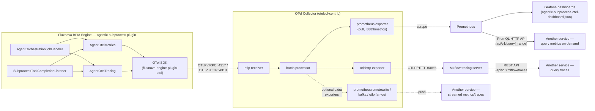

# Agentic Subprocess — GenAI OpenTelemetry Metrics & Traces

This document describes every OpenTelemetry signal emitted by the
`agentic-subprocess` module (produced by `AgentOtelMetrics` and
`AgentOtelTracing` in `agent-otel/.../agent/otel/`), and how each one maps onto
the [OpenTelemetry GenAI semantic conventions][semconv] (the conventions live in [
`open-telemetry/semantic-conventions-genai`][semconv-repo]
— they moved out of the main `opentelemetry-specification`/`semantic-conventions`
repos into their own).

[semconv]: https://github.com/open-telemetry/semantic-conventions-genai/blob/main/docs/gen-ai/README.md
[semconv-repo]: https://github.com/open-telemetry/semantic-conventions-genai

All instruments/spans use the `gen_ai.*` namespace and instrumentation scope
`org.finos.fluxnova.bpm.agentic`, so any OTLP-compatible backend (Prometheus, Grafana, MLflow, Datadog, etc.) recognises
them without a Fluxnova-specific vendor extension.

## Source → signal mapping

One BPMN ad-hoc agent subprocess execution produces the following direct orchestrator/listener call
flow, each of which drives both a metric and/or a span:

| Orchestrator call site                                                                                               | GenAI operation | Metric(s)                                                                                                                                                                | Span                           |
|----------------------------------------------------------------------------------------------------------------------|-----------------|--------------------------------------------------------------------------------------------------------------------------------------------------------------------------|--------------------------------|
| `AgentOrchestrationJobHandler.startSubprocessObservability(...)` / `endSubprocessObservability(...)`                | `invoke_agent`  | `gen_ai.client.token.usage`, `gen_ai.client.operation.duration`, `gen_ai.invoke_agent.duration`, `gen_ai.invoke_agent.inference_calls`, `gen_ai.invoke_agent.tool_calls` | `gen_ai.invoke_agent.internal` |
| `AgentOrchestrationJobHandler.execute(...)` around each LLM request/response (`otelTracing.startLlmCall`, `recordLlmCall`, `endLlmCall`) | `chat`          | `gen_ai.client.token.usage`, `gen_ai.client.operation.duration`                                                                                                          | `gen_ai.inference.client`      |
| `AgentOrchestrationJobHandler.execute(...)` tool-request dispatch + `SubprocessToolCompletionListener.notify(...)` tool completion/failure | `execute_tool`  | `gen_ai.client.operation.duration`, `gen_ai.execute_tool.duration`                                                                                                       | `gen_ai.execute_tool.internal` |

Span tree per subprocess execution:

```
invoke_agent {gen_ai.agent.name}          AgentOrchestrationJobHandler subprocess start/end
  chat {gen_ai.request.model}             AgentOrchestrationJobHandler LLM request/response
  execute_tool {gen_ai.tool.name}         Tool requested in AgentOrchestrationJobHandler, completed in SubprocessToolCompletionListener
  chat {gen_ai.request.model}
  ...
```

## Signal flow architecture

The engine itself never talks to Prometheus, Grafana, or MLflow directly — it
only ever emits OTLP (metrics + traces) over gRPC/HTTP via the OTel SDK
bootstrapped by `fluxnova-engine-plugin-otel` (`fluxnova-bpm-platform`,
`engine-plugins/otel-plugin`, configured through the
`OpenTelemetryProcessEnginePlugin` in `default.yml` — see
[`LOCAL_SETUP.md`](./LOCAL_SETUP.md) step 3). An **OTel Collector** is the
single integration point: it receives that OTLP stream and fans it out to
whatever backends are configured, so adding/changing a downstream consumer is
a collector-config change, not a plugin-code change.



### Querying/streaming these signals from another service

**Metrics (Prometheus-backed, pull model):**
- Point any PromQL-capable client (Grafana, another Prometheus with
  federation, a custom script) at Prometheus's HTTP API, e.g.
  `GET /api/v1/query?query=gen_ai_client_operation_duration_seconds_count`
  or `/api/v1/query_range` for a time series — no collector/engine changes
  needed, this is read-only against Prometheus's existing TSDB.
- To let a service *stream* metrics instead of polling, add a second
  exporter to the collector's `metrics` pipeline (e.g.
  `prometheusremotewrite` pointed at the service's remote-write endpoint, a
  `kafka` exporter, or a second `otlp`/`otlphttp` exporter pointed directly
  at the service's own OTLP receiver) — the `otlp` receiver already fans out
  to every exporter listed in the pipeline, so this is additive and doesn't
  disturb the existing `prometheus`/`debug` exporters.

**Traces (MLflow-backed here, but any OTLP trace backend works):**
- Query via MLflow's REST API,
  `GET /api/2.0/mlflow/traces?experiment_ids=<id>`, or browse
  http://localhost:5000 for the span tree (`invoke_agent` → `chat` /
  `execute_tool`).
- If the other service prefers a different trace store/API (Tempo, Jaeger,
  Zipkin, another OTLP collector), swap/add the corresponding exporter under
  `service.pipelines.traces` in the collector config — the spans themselves
  are already standard OTLP, no re-instrumentation required.
- For true push/streaming delivery to another service, add its OTLP
  endpoint as an additional `otlp`/`otlphttp` exporter in the `traces`
  pipeline, same pattern as the metrics fan-out above.

See [`LOCAL_SETUP.md`](./LOCAL_SETUP.md) for the concrete collector config,
ports, and troubleshooting steps used to validate this pipeline end-to-end.

### Harness OTLP receiver (backend-agnostic trace consumption)

The `harness/` test suite (`fluxnova.otel_client.OtelClient`) needs to read
`invoke_agent`/`execute_tool` span data back out for a specific run
(correlated by `gen_ai.conversation.id`) as an alternative to the plugin's
`/agent-otel` REST endpoint — see `harness/docs/deepeval-otel-gap-analysis.md`.

Deliberately, this does **not** query MLflow's (or any other backend's) own
tracking/query API — that would tie the harness to whichever backend the
collector happens to be configured with, defeating the "any OTLP-compatible
backend" point made above. Instead, `harness/src/fluxnova/otel_receiver.py`
is a small, dependency-light OTLP/HTTP **trace receiver** that the harness
runs itself: it accepts standard `POST /v1/traces` OTLP/HTTP protobuf
exports (gzip or plain) and appends each span as one JSON line to a local
file, keyed by `trace_id`. `OtelClient` then just reads that file and
filters by `gen_ai.conversation.id` — no vendor query DSL involved anywhere
in the harness.

Add it as a **second, additive** exporter in the collector's `traces`
pipeline (alongside `otlphttp/mlflow` from `LOCAL_SETUP.md` step 4 — this
doesn't replace or disturb that exporter, both receive the same spans):

```yaml
exporters:
  debug:
    verbosity: detailed
  otlphttp/mlflow:
    traces_endpoint: http://localhost:5000/v1/traces
    headers:
      x-mlflow-experiment-id: "1"
  otlphttp/harness:
    # Points at the harness's own local receiver (fluxnova.otel_receiver),
    # not a visualisation backend — see harness/docs/deepeval-otel-gap-analysis.md.
    traces_endpoint: http://localhost:4319/v1/traces

service:
  pipelines:
    traces:
      receivers: [otlp]
      exporters: [otlphttp/mlflow, otlphttp/harness, debug]
```

Run the receiver (from the harness project, with its venv active):

```powershell
otel-receiver --port 4319 --store harness/.fluxnova/otel-spans.json
```

Then in Python:

```python
from fluxnova.otel_client import OtelClient

client = OtelClient(store_path="harness/.fluxnova/otel-spans.json")
client.get_invoke_agent_metrics(correlation_id=process_instance_id)
client.get_tool_call_spans(correlation_id=process_instance_id)
```

If the collector later switches its visualisation backend (Tempo, Jaeger,
Datadog, ...), only the `otlphttp/mlflow` exporter line changes — the
`otlphttp/harness` exporter and everything downstream of it are unaffected,
since they only depend on the standard OTLP wire format and `gen_ai.*`
attributes, not on any backend-specific API.

## Metrics

### `gen_ai.client.token.usage`

- **Instrument:** histogram (long), unit `{token}`.
- **Recorded:** once per `chat` (LLM response path in `AgentOrchestrationJobHandler`) and once per
  `invoke_agent` (subprocess end path in `AgentOrchestrationJobHandler`, using accumulated totals)
  — one data point for input tokens and one for output tokens, each time.
- **Attributes:** `gen_ai.operation.name` (`chat`\|`invoke_agent`),
  `gen_ai.token.type` (`input`\|`output`), `gen_ai.provider.name`,
  `gen_ai.request.model` (all when available).
- **Spec alignment:** ✅ exact name/unit/instrument match with
  [`metrics.yaml`](https://github.com/open-telemetry/semantic-conventions-genai/blob/main/model/gen-ai/metrics.yaml).

### `gen_ai.client.operation.duration`

- **Instrument:** histogram (double), unit `s`.
- **Recorded:** once per `chat`, `execute_tool`, and `invoke_agent` operation, as the generic "one metric covers every
  GenAI operation type" instrument.
- **Attributes:** `gen_ai.operation.name`, `gen_ai.provider.name`,
  `gen_ai.request.model`, `gen_ai.tool.name`/`gen_ai.tool.call.id` (tool calls only), `error.type` (`tool_error`, tool
  failures only).
- **Spec alignment:** ✅ exact name/unit/instrument match.

### `gen_ai.invoke_agent.duration` *(new)*

- **Instrument:** histogram (double), unit `s`.
- **Recorded:** once per subprocess execution (subprocess end path in
  `AgentOrchestrationJobHandler`), value equal to the `gen_ai.client.operation.duration` value recorded for the same `invoke_agent` operation (per
  the spec's guidance that the two SHOULD match when both are emitted alongside an `invoke_agent.internal` span).
- **Attributes:** `gen_ai.agent.name`, `gen_ai.request.model`.
- **Spec alignment:** ✅ added to align with the dedicated agent-invocation metric the spec introduced alongside (not
  instead of) the generic
  `gen_ai.client.operation.duration`.

### `gen_ai.invoke_agent.inference_calls` / `gen_ai.invoke_agent.tool_calls` *(new)*

- **Instrument:** histograms (long), units `{inference_call}` / `{tool_call}`.
- **Recorded:** once per subprocess execution.
  - `gen_ai.invoke_agent.inference_calls` is read directly from the authoritative loop-count value
    — `AgentStateManager`'s `_agentLoopIndex` execution variable, passed by
    `AgentOrchestrationJobHandler.endSubprocessObservability(...)` — **not** a derived "one chat call per loop
    turn" count, so it stays correct even if a turn ever makes more/fewer than one LLM call.
  - `gen_ai.invoke_agent.tool_calls` is still derived from a per-`subprocessExecutionId` counter incremented as
    each `execute_tool` operation is recorded and flushed (recorded + cleared) when the subprocess ends.
- **Attributes:** `gen_ai.agent.name`.
- **Spec alignment:** ✅ added; matches the spec's per-invocation call-count metrics.

### `gen_ai.execute_tool.duration` *(new)*

- **Instrument:** histogram (double), unit `s`.
- **Recorded:** once per tool call (`SubprocessToolCompletionListener.notify(...)`
  completion/failure path), alongside the generic
  `gen_ai.client.operation.duration` recorded for the same event.
- **Attributes:** `gen_ai.tool.name`, `gen_ai.tool.call.id`,
  `gen_ai.agent.name` (the executing agent, when known), `error.type`
  (`tool_error`, tool failures only).
- **Spec alignment:** ✅ added; matches the spec's dedicated tool-execution duration metric.

### Not implemented (and why)

| Metric                                                                               | Reason                                                                                                                                               |
|--------------------------------------------------------------------------------------|------------------------------------------------------------------------------------------------------------------------------------------------------|
| `gen_ai.client.operation.time_to_first_chunk` / `.time_per_output_chunk`             | Streaming-only metrics; LLM calls here are synchronous request/response, not streamed.                                                               |
| `gen_ai.server.request.duration` / `.time_per_output_token` / `.time_to_first_token` | Server-side (model-host) metrics — this module instruments the client/orchestrator side only.                                                        |
| `gen_ai.invoke_workflow.duration`                                                    | No `invoke_workflow`-level concept exists in this module; each ad-hoc subprocess is modelled as a single `invoke_agent`, not a multi-agent workflow. |

## Traces

### `invoke_agent` span (type `gen_ai.invoke_agent.internal`)

- **Kind:** `INTERNAL` (correct — the agent loop runs in-process, not over a remote agent API).
- **Name:** `invoke_agent {gen_ai.agent.name}` (falls back to plain
  `invoke_agent` if the agent name is unavailable), per the spec's span-naming guidance. Uses the BPMN ad-hoc subprocess
  element id as `gen_ai.agent.name`
  — **not** the model, which was the naming used before this alignment pass.
- **Attributes:** `gen_ai.operation.name`, `gen_ai.agent.name`,
  `gen_ai.provider.name`, `gen_ai.request.model`, `gen_ai.conversation.id`
  (the process instance id), `gen_ai.usage.input_tokens`/`output_tokens`
  (accumulated totals, set at span end), `gen_ai.invoke_agent.inference_calls`/`.tool_calls`
  (set at span end, using the same authoritative values `AgentOtelMetrics` records for the
  corresponding metrics — the loop count supplied by
  `AgentOrchestrationJobHandler.endSubprocessObservability(...)` and the per-execution
  tool-call counter — so a trace-only consumer correlating by `gen_ai.conversation.id` can read
  the exact per-run counts directly off the span, instead of counting `chat`/`execute_tool` child
  spans, which would reintroduce the "1 chat call ≈ 1 loop turn" proxy assumption the metric-side
  fix was designed to eliminate), `gen_ai.system_instructions` (the subprocess goal —
  **opt-in**, see [Content capture](#content-capture-opt-in) below).
- **Lifecycle:** started on `AgentOrchestrationJobHandler.startSubprocessObservability(...)`,
  ended on `AgentOrchestrationJobHandler.endSubprocessObservability(...)`.

### `chat` span (type `gen_ai.inference.client`)

- **Kind:** `CLIENT` (correct — this represents a call to an LLM provider).
- **Name:** `chat {gen_ai.request.model}`.
- **Attributes:** `gen_ai.operation.name`, `gen_ai.request.model`,
  `gen_ai.response.model`, `gen_ai.provider.name` (set at span creation when already known from the request, refreshed
  at span end),
  `gen_ai.usage.input_tokens`/`output_tokens`, `gen_ai.input.messages`/`gen_ai.output.messages`
  (the raw prompt/response text — **opt-in**, see [Content capture](#content-capture-opt-in) below).
- **Lifecycle:** started immediately before `llmService.call(...)`, ended immediately after the
  response is received. Correlated by `subprocessExecutionId|loopIndex` since LLM calls are synchronous within a single job
  execution.

### `execute_tool` span (type `gen_ai.execute_tool.internal`)

- **Kind:** `INTERNAL` (correct — tools here are BPMN ad-hoc activities executed in-process, not a remote tool-execution
  service).
- **Name:** `execute_tool {gen_ai.tool.name}`.
- **Attributes:** `gen_ai.operation.name`, `gen_ai.tool.name`,
  `gen_ai.tool.call.id`, `gen_ai.agent.name` (the executing agent, when known), `error.type` (`tool_error`, on failure),
  `gen_ai.tool.call.arguments`/`gen_ai.tool.call.result` (the raw tool input/output — **opt-in**, see
  [Content capture](#content-capture-opt-in) below).
- **Lifecycle:** started when `AgentOrchestrationJobHandler` dispatches a requested tool call,
  ended in `SubprocessToolCompletionListener.notify(...)` on completion/failure. Correlated by
  `toolCallId` since tool activities execute asynchronously across separate job executions.

### Content capture (opt-in)

Per the spec's guidance that content capture is opt-in, `gen_ai.system_instructions`,
`gen_ai.input.messages`, `gen_ai.output.messages`, and `gen_ai.tool.call.arguments`/`.result` are
**disabled by default** — they are only set on the spans above when explicitly enabled, since they
carry the raw agent goal, LLM prompts/responses, and tool inputs/outputs, which may contain
sensitive business or personal data.

Enable them via either:
- the Spring Boot property `fluxnova.ai.agent.observability.capture-content: true` (bound by
  `AgentOtelContentCaptureProperties` in `agent-otel`); or
- the standard `OTEL_INSTRUMENTATION_GENAI_CAPTURE_MESSAGE_CONTENT=true` environment variable used
  by other OpenTelemetry GenAI instrumentation.

`gen_ai.tool.definitions` remains **not implemented** even when content capture is enabled — no
tool-catalogue data currently flows through these direct observability calls, so there is nothing to attach it
from.

### Known gaps

- **No failure signalling above the tool level.** `error.type` /
  `StatusCode.ERROR` is only ever set on `execute_tool` spans/metrics, from
  the tool completion path's `failed` / `errorMessage` values.
  The direct subprocess and LLM observability calls carry no status/error field, so `invoke_agent` and `chat`
  spans always end with
  `StatusCode.OK` even if the underlying job ultimately fails/retries. Closing this gap would require plumbing a
  status/error field through `AgentOrchestrationJobHandler` (wrapping `llmService.call(...)` and
  the subprocess-termination path) — tracked as follow-up work, not implemented here.
- **Span leak on unhandled LLM exceptions.** Because `llmService.call(...)`
  is not wrapped in a try/catch in `AgentOrchestrationJobHandler`, an exception there means the
  in-flight `chat` span is never closed or exported. This is
  a consequence of the same gap above (no error event to react to) rather than a bug in `AgentOtelTracing` itself.

## Dashboard

See [`README.md`](./README.md) for the Grafana dashboards (`agentic-subprocess-otel-dashboard.json` / `.v2.json`) that
visualise the
`gen_ai.client.*` instruments, and [`LOCAL_SETUP.md`](./LOCAL_SETUP.md) for a local Prometheus/Grafana/MLflow stack to
verify all of the above end-to-end.
